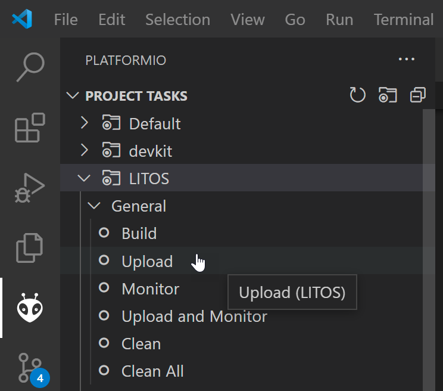
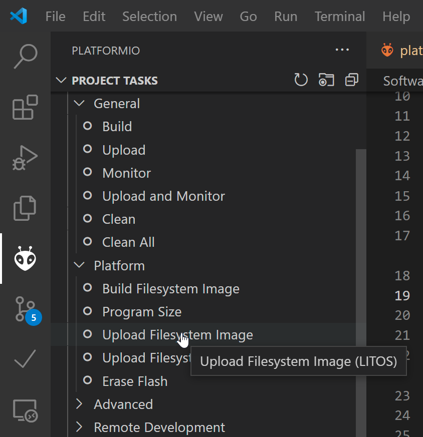

# LITOS flashing instructions

In this folder, you find all the needed files to flash your own LITOS device. 

## Getting started

As development environment for LITOS software Visual Studio Code with the Addon PlatformIO has been used. Thus, before you can flash a LITOS, you need to fulfill the following prerequisites.  
1. Install [VS Code](https://code.visualstudio.com/) on your computer
2. Install the [PlatformIO](https://platformio.org/install/ide?install=vscode) extension from within VS Code
3. Clone or download our current [LITOS release](https://github.com/AlexLandolt/LITOS/releases/) from GitHub. 
4. Add the *Software* subfolder of the release in VS by right click and then *Add folder to workspace*. 

Now you are ready to flash a LITOS device. 

## LITOS flashing process

LITOS running on the microcontroller consists of two parts. On one side, there is LITOS firmware, on the other LITOS requires a SPIFFS filesystem image. Both can be flashed in VS Code when PlatformIO is installed. Connect LITOS with an USB cable to a computer. 

- First flash the firmware image by click on *Upload* in the PlatformIO tab in VS code. 

- Next, you need to flash to upload the SPIFFS filesystem image by tapping on *Upload filesystem Image*

If your LITOS isn't entering flashing mode (upload not working), you can force LITOS to enter the flashing mode by the following procedure: 
1. Tap on the *Upload* button or *Upload filesystem Image* in VS Code. 
2. Press the **RST** and **BOOT** button on the LITOs PCB simultanously. 
3. Release the **RST** button while still pressing the **BOOT** button. 
4. The upload process should now start, as soon as you release the **BOOT** button. 